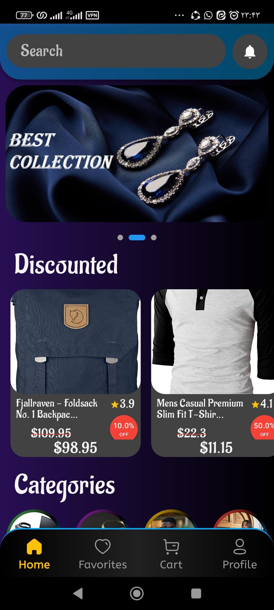
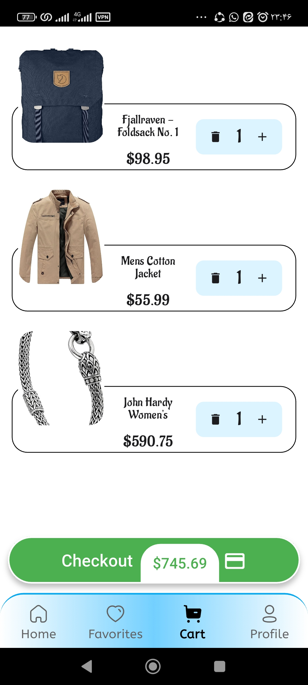
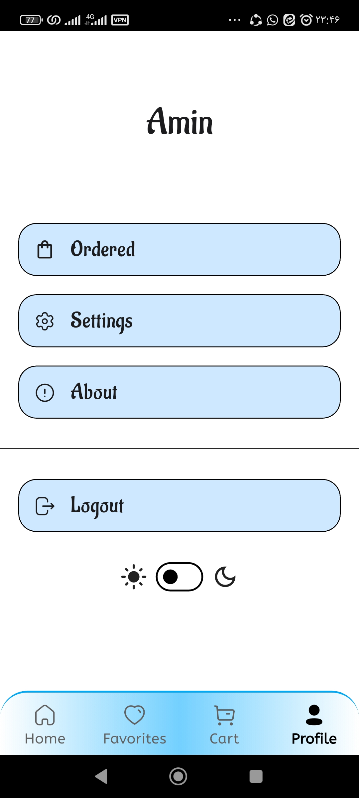

# 🛍️ Flutter E-Commerce App

A modern **Flutter** e-commerce application with **Clean Architecture** and **Bloc** state management. This project is designed to showcase my skills in developing scalable and maintainable Flutter applications.  

## ✨ Features
- 🔐 **Authentication** (Sign In / Sign Up)
- 🛒 **Product Listing & Categories**
- ❤️ **Wishlist & Cart Management**
- 🌙 **Dark & Light Theme Support** 
- 🛠 **Implemented with Clean Architecture & Repository Pattern**  

## 📱 Screenshots
  

## 🚀 Tech Stack
- **Flutter**
- **Dart**
- **Bloc (State Management)**
- **Firebase Authentication**
- **REST API (Dio)**
- **shared_preferences for local storage**
- **GitHub Actions for CI/CD**

## 🔗 Download APK
[Download Latest Release](https://github.com/AminKhanZadeh1/bloc_online_shop/releases)  

## 👨‍💻 About Me
I am a **Flutter Developer** passionate about building high-performance mobile applications. I have experience with **state management, clean architecture, and CI/CD automation**.  

📩 Feel free to reach out:  
- **LinkedIn:** [linkedin.com/in/amin-khanzadeh-138a212b4](https://www.linkedin.com/in/amin-khanzadeh-138a212b4/)
- **GitHub:** [github.com/AminKhanZadeh1](https://github.com/AminKhanZadeh1)  
- **Email:** [aminmusic.original1@gmail.com](mailto:aminmusic.original1@gmail.com)
  
---

🚀 **If you like this project, don't forget to give it a ⭐ on GitHub!**
